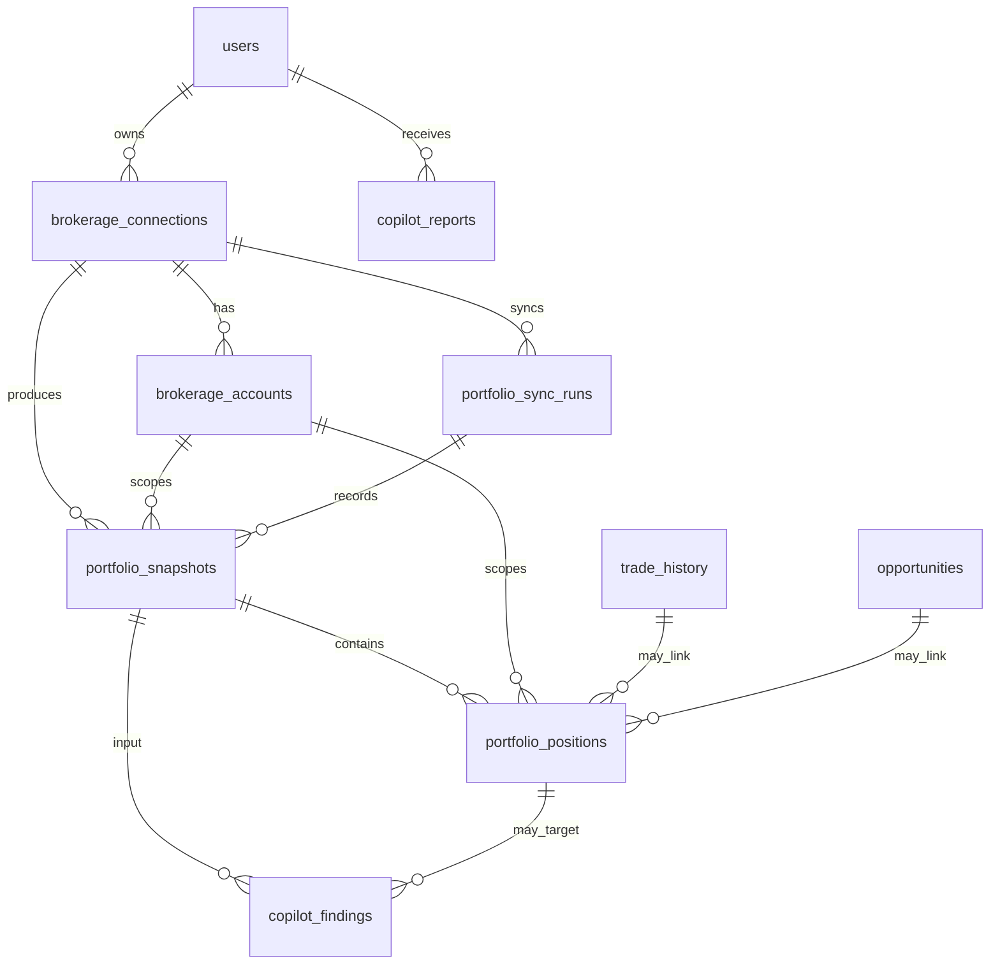

# SwingFi Copilot Data Model

Last updated: 2026-07-17

This document describes the additive database foundation for future SwingFi Copilot portfolio reports. Copilot remains read-only research software. The schema does not connect brokerage accounts, store brokerage credentials, place trades, or duplicate existing SwingFi trading-plan tables.

## Migration Files

- `db/copilot-schema-migration.sql`
- `db/copilot-schema-rollback.sql`
- `db/copilot-rls-verification.sql`

The migration has not been applied to production. It is designed to be reviewed and tested against a local Supabase/PostgreSQL environment first.

## Existing Tables Reused

Copilot intentionally references existing SwingFi data instead of creating parallel concepts:

- `users`: owns every Copilot row through `user_id`.
- `trade_history`: remains the source of user-created manual swing plans and open positions.
- `opportunities`: remains the source of SwingFi-ranked opportunity plans.

The migration adds a unique index on `trade_history(id, user_id)` so `portfolio_positions.source_trade_history_id` can use a composite foreign key. That prevents a position from claiming a trade owned by another user.

## New Tables

### `brokerage_connections`

Stores read-only provider connection metadata for a user.

Important fields:

- `user_id`: owner.
- `provider_id`: one of `manual_trade_history`, `mock_local`, `snaptrade`, `plaid_investments`, or `broker_specific`.
- `external_connection_id`: opaque provider-side reference only.
- `status`: connection lifecycle state.
- `capabilities`: JSON capability flags. `canPlaceOrders` is constrained to `false`.
- `last_sync_started_at`, `last_synced_at`, `data_as_of`: sync and freshness timestamps.
- `last_error_code`, `last_error_message`: sanitized operational errors.

No password, token, refresh token, access token, API key, or raw secret columns exist.

### `brokerage_accounts`

Stores normalized read-only account display metadata under a connection.

Important fields:

- `connection_id` plus `user_id`: composite foreign key back to `brokerage_connections`.
- `external_account_id`: opaque provider account reference.
- `display_name`: customer-facing account label.
- `masked_account_identifier`: optional display mask only.
- `account_type`, `currency`, `status`, `data_as_of`.

The table does not store full account numbers or login credentials.

### `portfolio_sync_runs`

Stores audit records for read-only portfolio sync attempts.

Important fields:

- `connection_id` plus `user_id`: composite owner-safe connection reference.
- `provider_sync_key`: optional idempotency key or provider run reference.
- `status`: `running`, `completed`, `partial`, or `failed`.
- `started_at`, `completed_at`, `data_as_of`.
- `account_count`, `position_count`.
- `error_code`, `error_message`: sanitized only.

The unique partial index on `(connection_id, provider_sync_key)` avoids duplicate provider run imports when a provider supplies a stable sync key.

### `portfolio_snapshots`

Stores point-in-time normalized portfolio snapshots.

Important fields:

- `connection_id`, `account_id`, `sync_run_id`: optional composite owner-safe references.
- `source_type`: `manual`, `brokerage`, `mock`, or `imported`.
- `total_value`, `cash_value`, `invested_value`: nullable because some sources will not have complete values.
- `completeness`: JSON object describing missing or partial source data.
- `status`: `empty`, `partial`, `complete`, `stale`, or `failed`.
- `data_as_of`: when the underlying portfolio data was current.
- `captured_at`: when SwingFi saved the snapshot.
- `source_hash`: sanitized deduplication key.

`captured_at >= data_as_of` is enforced so future provider adapters do not write future-dated source data.

### `portfolio_positions`

Stores normalized positions belonging to a snapshot.

Important fields:

- `snapshot_id` plus `user_id`: composite owner-safe snapshot reference.
- `account_id` plus `user_id`: optional owner-safe account reference.
- `symbol`, `asset_type`.
- `quantity`, `average_cost`, `market_price`, `market_value`, `unrealized_gain_loss`: nullable where a provider or manual source lacks data.
- `source_position_id`: opaque provider position reference.
- `source_trade_history_id` plus `user_id`: optional link to an existing `trade_history` row.
- `opportunity_id`: optional link to the SwingFi opportunity that informed the plan.
- `data_as_of`.

This table is a normalized snapshot of a position. It does not overwrite the original `trade_history` plan.

### `copilot_findings`

Stores deterministic review findings generated from normalized data.

Important fields:

- `account_id`, `position_id`, `symbol`: optional target of the finding.
- `finding_type`: `position_review`, `risk_alert`, `opportunity_match`, `data_freshness`, `portfolio_balance`, or `missing_data`.
- `severity`: `positive`, `watch`, `risk`, or `missing_data`.
- `evidence`: structured JSON array of sanitized evidence.
- `message`: customer-safe review message.
- `input_snapshot_id`: optional source snapshot.
- `input_version`: analyzer version.

Findings should explain what SwingFi sees. They must not contain guaranteed-return claims or direct order instructions.

### `copilot_reports`

Stores generated Copilot reports.

Important fields:

- `report_date`.
- `portfolio_data_as_of`.
- `structured_input`: sanitized input used to build the report.
- `deterministic_summary`: calculated summary produced by deterministic code.
- `narrative_text`: optional AI or deterministic narration.
- `narrator_model`, `prompt_version`.
- `input_hash`: idempotency key for report inputs.
- `generation_status`, `error_code`, `error_message`.

AI narration may explain structured evidence, but numeric values must come from deterministic inputs.

## Timestamp Conventions

The existing schema uses `created_at` defaults and some `updated_at` defaults, but it does not define a shared `updated_at` trigger convention. This migration follows that pattern:

- `created_at` defaults to `now()`.
- `updated_at` exists where lifecycle rows may be updated later.
- No update trigger is added.
- Future server-side repositories must set `updated_at` explicitly when updating connection or account state.

## RLS And Write Model

Every new user-owned table has row level security enabled.

Read policies:

- A user can select only rows where `user_id = current_app_user_id()`.
- Admin users can select rows through `current_app_user_is_admin()`.

Write policies:

- No browser/client insert, update, or delete policies are created for the new Copilot tables.
- Future writes must go through server-only APIs using the service-role client and explicit `user_id` scoping.
- This mirrors SwingFi's existing service-side persistence pattern for operations that should not be broadly writable from the browser.

## Relationship Diagram

## Assumptions And Unknowns

- Local Supabase was not confirmed available, so the migration was not executed.
- External brokerage provider behavior is intentionally unknown until SwingFi chooses a provider.
- Future encrypted credential storage is out of scope and should be designed separately if an external provider is selected.
- The future repository layer should keep all Copilot writes server-only and should add integration tests around explicit `user_id` scoping.
