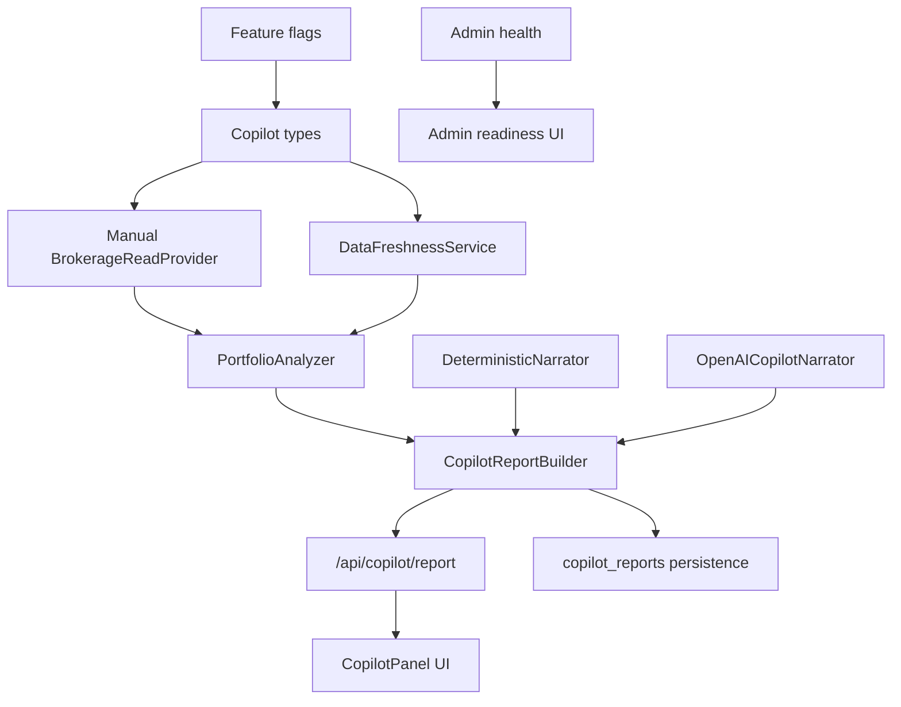

# SwingFi Copilot Implementation Map

Last updated: 2026-07-17

SwingFi Copilot should start as a read-only research layer over existing SwingFi rankings and manually tracked trades. It must not connect brokerage accounts, collect brokerage passwords, place trades, make direct order recommendations, or imply guaranteed returns.

## Product Boundary

Copilot is:

- A read-only portfolio research assistant.
- A structured analyzer of holdings, saved trades, daily picks, market data, news, filings, and prediction outcomes.
- A plain-language report builder for beginner and intermediate swing traders.

Copilot is not:

- A broker.
- A live-trading tool.
- A paper-trading tool in phase 1.
- A password vault.
- A personalized financial adviser.
- A guaranteed-return prediction engine.

## Hard Constraints

- No live trading.
- No brokerage SDK selection in the first implementation.
- No account-password collection.
- No withdrawal or transfer capability.
- No direct "buy now" or "sell now" language.
- No guaranteed-return language.
- Numeric calculations must be deterministic.
- AI may explain structured evidence but may not invent prices, returns, stops, targets, quantities, holdings, or account values.
- Every future provider datum must include `fetched_at` and `data_as_of`.
- All future user-owned records must be protected by RLS and server authorization.
- All new product functionality must default off behind feature flags.

## Recommended Feature Flags

Add these before any Copilot UI or API ships:

- `NEXT_PUBLIC_COPILOT_ENABLED=false`
- `COPILOT_READ_PROVIDER=manual`
- `COPILOT_EXTERNAL_BROKERAGE_ENABLED=false`
- `COPILOT_PAPER_TRADING_ENABLED=false`
- `COPILOT_AI_NARRATION_ENABLED=false`

## Provider-Neutral Architecture

Start with one provider: the existing manual SwingFi portfolio based on `trade_history`.

Recommended module layout:

```text
lib/copilot/
  types.ts
  providers/
    BrokerageReadProvider.ts
    manual-trade-history-provider.ts
    provider-registry.ts
  analysis/
    portfolio-analyzer.ts
    data-freshness-service.ts
    benchmark-service.ts
    risk-exposure-service.ts
  reports/
    copilot-report-builder.ts
    copilot-narrator.ts
    deterministic-narrator.ts
    openai-copilot-narrator.ts
  execution/
    PaperExecutionProvider.ts
    disabled-paper-provider.ts
  repositories/
    copilot-reports.ts
    copilot-snapshots.ts
app/api/copilot/
  report/route.ts
  freshness/route.ts
  providers/route.ts
components/copilot/
  CopilotPanel.tsx
  CopilotReportCard.tsx
  CopilotFindingList.tsx
  CopilotFreshnessPanel.tsx
```

## Core Types

`lib/copilot/types.ts`

```ts
export type CopilotProviderKey = "manual_trade_history" | "snaptrade" | "plaid_investments" | "broker_specific";

export type ProviderFreshness = {
  fetchedAt: string;
  dataAsOf: string;
  source: string;
  status: "fresh" | "stale" | "missing" | "error";
  message?: string;
};

export type CopilotHolding = {
  providerHoldingId: string;
  userId: string;
  symbol: string;
  assetType: "stock" | "etf" | "crypto";
  quantity: number;
  averageEntryPrice: number;
  currentPrice: number | null;
  marketValue: number | null;
  openedAt: string | null;
  source: CopilotProviderKey;
  sourceTradeHistoryId?: string;
  fetchedAt: string;
  dataAsOf: string;
};

export type CopilotFindingSeverity = "positive" | "watch" | "risk" | "missing_data";

export type CopilotFinding = {
  id: string;
  symbol?: string;
  severity: CopilotFindingSeverity;
  title: string;
  plainEnglish: string;
  evidence: Array<{
    label: string;
    value: string;
    source: string;
    fetchedAt: string;
    dataAsOf: string;
  }>;
};

export type CopilotReport = {
  id: string;
  userId: string;
  generatedAt: string;
  providerKey: CopilotProviderKey;
  summary: string;
  holdings: CopilotHolding[];
  findings: CopilotFinding[];
  freshness: ProviderFreshness[];
};
```

## BrokerageReadProvider Interface

`lib/copilot/providers/BrokerageReadProvider.ts`

```ts
export interface BrokerageReadProvider {
  key: CopilotProviderKey;
  displayName: string;
  mode: "manual" | "external";
  isEnabled(): boolean;
  getHoldings(userId: string): Promise<{
    holdings: CopilotHolding[];
    freshness: ProviderFreshness[];
  }>;
}
```

Rules:

- Provider outputs must be normalized to `CopilotHolding`.
- Providers must never return raw access tokens, account numbers, passwords, or secret metadata to client APIs.
- External provider outputs must store `fetched_at` and `data_as_of` for every snapshot.
- Provider registry should return only enabled providers.
- Phase 1 registry should return only the manual provider.

## Manual Portfolio Provider

`lib/copilot/providers/manual-trade-history-provider.ts`

Source of truth:

- `trade_history`
- `app/api/portfolio/route.ts`
- `lib/portfolio/exit-plan.ts`
- `lib/portfolio/intelligence.ts`

Behavior:

- Read open/planned `trade_history` rows for the current `user_id`.
- Convert each row to `CopilotHolding`.
- Use `entry_price`, `quantity`, `symbol`, `asset_type`, `opened_at`, and `id`.
- Fetch current price through existing FMP provider or reuse portfolio enrichment code.
- Mark `source = "manual_trade_history"`.
- Set `fetchedAt` to the time the provider ran.
- Set `dataAsOf` to the latest quote/candle timestamp available; if unavailable, use fetched time with status `missing`.

Why this should be first:

- It reuses the data users already create today.
- It avoids brokerage authorization and compliance risk.
- It lets SwingFi validate Copilot UX before choosing SnapTrade, Plaid Investments, or broker-specific APIs.

## Provider Registry

`lib/copilot/providers/provider-registry.ts`

Initial behavior:

- Return manual provider when `NEXT_PUBLIC_COPILOT_ENABLED=true`.
- Do not expose SnapTrade, Plaid, or broker-specific providers until the business selects one.
- If `COPILOT_EXTERNAL_BROKERAGE_ENABLED=false`, external providers must not instantiate.

Future provider slots:

- `SnapTradeReadProvider`
- `PlaidInvestmentsReadProvider`
- `SchwabReadProvider`
- `FidelityReadProvider`

These should be added later without changing `PortfolioAnalyzer`, `CopilotReportBuilder`, or UI contracts.

## Deterministic PortfolioAnalyzer

`lib/copilot/analysis/portfolio-analyzer.ts`

Inputs:

- Normalized `CopilotHolding[]`.
- Latest opportunities from `listLatestOpportunities()`.
- Existing `trade_history` targets/stops.
- FMP prices/candles/news/events/filings.
- Prediction/backtest summaries where allowed.
- User preferences from `users`.

Outputs:

- Deterministic `CopilotFinding[]`.
- Numeric metrics only from structured inputs.

Initial findings:

- Position is near saved stop.
- Position is near saved target.
- Position has passed the planned holding window.
- Position is not in today's ranked set.
- Position is above today's SwingFi entry range, so adding would be chasing.
- Position is inside or below today's SwingFi entry range.
- Current quote is stale or missing.
- News/event/SEC risk changed since the original plan.
- Portfolio is concentrated in one sector, if sector data is available.

Do not use AI for:

- Calculating market value.
- Calculating open P/L.
- Calculating target/stop distance.
- Calculating allocation.
- Choosing quantities.
- Inventing targets or stops.

## DataFreshnessService

`lib/copilot/analysis/data-freshness-service.ts`

Purpose:

- Create a visible trust layer for every report and every holding.
- Standardize freshness across FMP, SEC, FRED, BLS, Treasury, OpenAI narration, manual provider, and future brokerage providers.

Inputs:

- Provider freshness records.
- FMP quote/candle/news timestamps.
- SEC filing dates.
- Macro run timestamps.
- Latest `agent_runs.completed_at`.
- Latest `prediction_outcomes.evaluated_at`.

Output:

- `ProviderFreshness[]`.

Rules:

- Every future provider datum must have `fetched_at` and `data_as_of`.
- Stale thresholds should be deterministic and visible.
- Missing data should lower narration confidence but should not be hidden.

## CopilotReportBuilder

`lib/copilot/reports/copilot-report-builder.ts`

Responsibilities:

1. Resolve customer session outside the builder.
2. Load enabled providers from registry.
3. Pull normalized holdings.
4. Load latest SwingFi rankings/opportunities.
5. Load user preferences.
6. Run `PortfolioAnalyzer`.
7. Run `DataFreshnessService`.
8. Optionally call a narrator.
9. Persist report snapshot if the feature flag is enabled.
10. Return a report DTO to UI.

The report builder should be deterministic before narration. If OpenAI fails, the same deterministic findings should still render.

## CopilotNarrator Interface

`lib/copilot/reports/copilot-narrator.ts`

```ts
export interface CopilotNarrator {
  narrate(report: {
    findings: CopilotFinding[];
    holdings: CopilotHolding[];
    freshness: ProviderFreshness[];
  }): Promise<{
    mode: "deterministic" | "openai";
    summary: string;
    findingNarration: Record<string, string>;
  }>;
}
```

Rules:

- AI explains structured evidence only.
- AI may not calculate or invent portfolio values.
- AI may not invent prices, returns, stops, targets, quantities, account values, or news.
- AI may not use direct "buy now" or "sell now" wording.
- AI must preserve legal language: research software, not financial advice.
- Deterministic narrator must always be available as fallback.

## PaperExecutionProvider Abstraction

This should be interface-only in the map and must not be enabled until a later product/legal decision.

`lib/copilot/execution/PaperExecutionProvider.ts`

```ts
export interface PaperExecutionProvider {
  key: "disabled" | "future_paper";
  isEnabled(): boolean;
  createIntent(input: {
    userId: string;
    symbol: string;
    side: "watch" | "paper_open" | "paper_close";
    quantity?: number;
    reason: string;
  }): Promise<{ intentId: string; status: "recorded" | "disabled" }>;
}
```

Phase 1 implementation:

- `disabled-paper-provider.ts` always returns disabled.
- No paper account balances.
- No simulated order fills.
- No live provider.
- No UI button that says buy/sell.

## Proposed Database Additions

Do not apply these migrations in the audit task. These are future proposals.

### `copilot_provider_connections`

Purpose: future external provider metadata only.

Columns:

- `id uuid primary key`
- `user_id uuid not null references users(id) on delete cascade`
- `provider_key text not null`
- `provider_user_ref text`
- `status text not null`
- `last_synced_at timestamptz`
- `created_at timestamptz not null default now()`
- `updated_at timestamptz not null default now()`

Notes:

- No raw tokens in this table.
- Token storage/encryption design must be chosen before external providers.
- RLS: user owns row; admin read only if needed.

### `copilot_holding_snapshots`

Purpose: timestamped normalized holdings from manual or future providers.

Columns:

- `id uuid primary key`
- `user_id uuid not null references users(id) on delete cascade`
- `provider_key text not null`
- `source_trade_history_id uuid references trade_history(id) on delete set null`
- `symbol text not null`
- `asset_type asset_type not null`
- `quantity numeric(18, 8) not null`
- `average_entry_price numeric(14, 2) not null`
- `current_price numeric(14, 2)`
- `market_value numeric(14, 2)`
- `fetched_at timestamptz not null`
- `data_as_of timestamptz not null`
- `raw_provider_ref text`
- `created_at timestamptz not null default now()`

Relationship to current tables:

- Manual snapshots reference existing `trade_history.id`.
- Do not duplicate open/closed trade state from `trade_history`; snapshot only point-in-time holdings evidence.

### `copilot_reports`

Purpose: store generated report summaries for history, auditability, and email digests.

Columns:

- `id uuid primary key`
- `user_id uuid not null references users(id) on delete cascade`
- `provider_key text not null default 'manual_trade_history'`
- `summary text not null`
- `findings jsonb not null default '[]'::jsonb`
- `freshness jsonb not null default '[]'::jsonb`
- `generated_at timestamptz not null default now()`
- `created_at timestamptz not null default now()`

Relationship to current tables:

- Can link findings to `trade_history`, `opportunities`, and `prediction_outcomes` by embedded IDs.
- Does not replace `prediction_outcomes` or `backtest_runs`.

### `copilot_order_intents`

Purpose: future audit ledger for non-live intent, not orders.

Columns:

- `id uuid primary key`
- `user_id uuid not null references users(id) on delete cascade`
- `symbol text not null`
- `intent_type text not null`
- `source text not null`
- `reason text not null`
- `status text not null default 'recorded'`
- `created_at timestamptz not null default now()`

Rules:

- Do not implement in phase 1 UI unless legal approves wording.
- Never call this a trade order.
- Never connect to live brokerage execution.

## API Plan

Phase 1 API paths:

- `app/api/copilot/report/route.ts`
  - Requires `resolveCustomerSession`.
  - Requires `NEXT_PUBLIC_COPILOT_ENABLED=true`.
  - Uses manual provider only.
  - Returns `CopilotReport`.
- `app/api/copilot/freshness/route.ts`
  - Requires session.
  - Returns freshness status for holdings and daily ranking data.
- `app/api/copilot/providers/route.ts`
  - Requires session.
  - Returns enabled provider list and disabled future-provider placeholders.

Admin API paths:

- `app/api/admin/copilot/reports/route.ts`
  - Admin-only report counts and freshness summary.
- `app/api/admin/copilot/health/route.ts`
  - Admin-only provider health and missing env flags.

## UI Plan

Customer UI:

- Add a Copilot section inside `app/portfolio/page.tsx` first.
- Do not create a separate nav item until the feature proves useful.
- Use `components/copilot/CopilotPanel.tsx`.
- Show three layers:
  - "What needs attention"
  - "What looks on track"
  - "What data is stale or missing"
- Use beginner wording and avoid crowded metric tables.

Admin UI:

- Add a disabled-by-default Copilot readiness card in `AdminWorkspace`.
- Show:
  - Feature flag status.
  - Manual provider status.
  - External provider status disabled.
  - Freshness health.
  - Reports generated.
  - Last error.

## Dependency Graph



## Merge Order For Small Pull Requests

### PR 1: Flags, Types, And Manual Provider

Files:

- `.env.example`
- `lib/copilot/types.ts`
- `lib/copilot/providers/BrokerageReadProvider.ts`
- `lib/copilot/providers/manual-trade-history-provider.ts`
- `lib/copilot/providers/provider-registry.ts`

Acceptance tests:

- Typecheck passes.
- Manual provider returns no rows for a user with no open trades.
- Manual provider returns only rows scoped to the requested `userId`.
- Every returned holding has `fetchedAt` and `dataAsOf`.

Rollback:

- Remove `lib/copilot/**` and env example additions. No user-facing behavior should change.

### PR 2: Deterministic Analyzer And Freshness

Files:

- `lib/copilot/analysis/portfolio-analyzer.ts`
- `lib/copilot/analysis/data-freshness-service.ts`
- `lib/copilot/reports/deterministic-narrator.ts`

Acceptance tests:

- Near stop finding is generated from deterministic price/stop inputs.
- Near target finding is generated from deterministic price/target inputs.
- Stale/missing quote freshness is flagged.
- No OpenAI key is required.

Rollback:

- Remove analyzer/freshness files. Manual provider remains unused.

### PR 3: Copilot Report API

Files:

- `lib/copilot/reports/copilot-report-builder.ts`
- `lib/copilot/reports/copilot-narrator.ts`
- `app/api/copilot/report/route.ts`
- `app/api/copilot/freshness/route.ts`
- `app/api/copilot/providers/route.ts`

Acceptance tests:

- Unauthenticated request gets 401.
- Authenticated user sees only own manual trades.
- Feature flag off returns 404 or disabled response.
- OpenAI disabled still returns deterministic report.

Rollback:

- Disable `NEXT_PUBLIC_COPILOT_ENABLED`; remove API route files if needed.

### PR 4: Portfolio UI

Files:

- `components/copilot/CopilotPanel.tsx`
- `components/copilot/CopilotReportCard.tsx`
- `components/copilot/CopilotFindingList.tsx`
- `components/copilot/CopilotFreshnessPanel.tsx`
- `components/SwingPortfolioPanel.tsx` or `app/portfolio/page.tsx`

Acceptance tests:

- Mobile viewport does not horizontally scroll.
- No report renders when flag is off.
- Empty portfolio state is clear.
- Findings use plain language.
- No "buy now" or "sell now" strings appear.

Rollback:

- Hide UI behind flag or remove component import.

### PR 5: Optional Report Persistence

Files:

- Future SQL migration.
- `lib/copilot/repositories/copilot-reports.ts`
- `lib/database.types.ts`

Acceptance tests:

- RLS allows own reports only.
- Admin can read aggregate report status.
- Report persistence failure does not break live portfolio display.

Rollback:

- Disable persistence flag.
- Keep UI using live deterministic report generation.

### PR 6: Admin Copilot Health

Files:

- `app/api/admin/copilot/health/route.ts`
- `components/admin` or `components/AdminWorkspace.tsx` integration.

Acceptance tests:

- Non-admin gets 403.
- Admin sees provider status, freshness, and last report generation.
- Missing Supabase/service role is shown clearly.

Rollback:

- Remove admin card or disable route.

## Acceptance Criteria For Phase 1

- Copilot is completely disabled by default.
- When enabled, Copilot uses only manual `trade_history`.
- No external brokerage SDK is installed.
- No provider secrets are collected.
- No account passwords are collected.
- No live or paper trading is implemented.
- Customer sees only their own holdings and reports.
- Every provider datum has `fetchedAt` and `dataAsOf`.
- All portfolio values and distances are deterministic.
- AI narration is optional and cannot change numeric values.
- UI language says "review", "watch", "compare", or "check", not direct order commands.
- Build, typecheck, and lint pass or failures are documented.

## Work That Must Not Be Attempted Yet

Do not attempt these until a brokerage provider and legal/compliance approach are selected:

- SnapTrade integration.
- Plaid Investments integration.
- Schwab/Fidelity direct brokerage APIs.
- OAuth token storage.
- Encrypted provider token vault.
- Live order placement.
- Paper trading simulations.
- Account balance syncing.
- Options trading.
- Short selling.
- Margin checks.
- Suitability questionnaires for personalized financial advice.
- Direct "buy", "sell", "increase position", or "liquidate" instructions.
- Tax-lot reporting.
- Automated position sizing.
- Auto-generated trade orders.
- Any claim that SwingFi predicts guaranteed winners.

## Recommended First Implementation PR

Build PR 1 only:

- Add Copilot feature flags.
- Add provider-neutral types.
- Add `BrokerageReadProvider`.
- Add manual `trade_history` provider.
- Add registry returning only manual provider.
- Add narrow unit-style TypeScript checks if a test harness is introduced, otherwise rely on `npm run typecheck`, `npm run lint`, and code review.

This creates the foundation without changing product behavior or creating brokerage/compliance risk.
